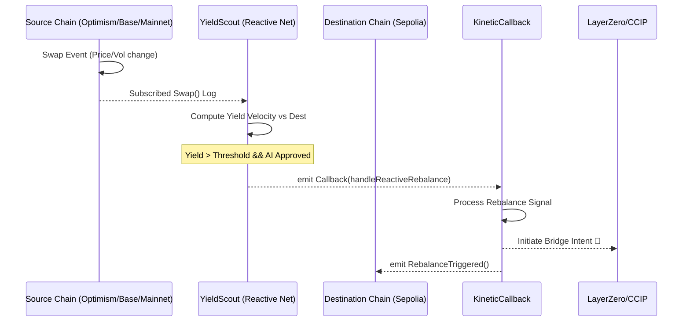

# 🏄 KineticYield: Autonomous AI-LP Rebalancer

 
 


**KineticYield** is an autonomous multi-chain liquidity management engine that eliminates "lazy capital." By leveraging the **Reactive Network** as a cross-chain brain and integrating **AI-driven sentiment and volume forecasting**, it monitors the entire DeFi ecosystem and proactively shifts Uniswap v4 liquidity to the highest-yielding opportunities before the market moves.

---

## 🎯 The Core Problem

Liquidity Providing (LPing) in Uniswap v4 is a dynamic game. Capital often becomes "static," trapped in low-yield pools on one chain while another chain experiences a massive volume spike. Manual rebalancing is too slow, and traditional cross-chain rebalancers use reactive logic that only moves *after* the opportunity has peaked.

### 🌊 How KineticYield Solves It:
1.  **"Global Awareness"**: Monitors volume and fees across Ethereum, Base, Optimism, and Arbitrum in real-time via the Reactive Network.
2.  **Predictive Rebalancing**: Uses an off-chain AI strategy to update on-chain rebalance thresholds, anticipating market shifts before they happen.
3.  **Cross-Chain Execution**: Automatically withdraws liquidity from underperforming pools and initiates bridge intents to the highest-yielding destinations.

---

## 🚀 Hackathon Alignment

Our project proudly aligns with the following Reactive Network focus areas:
- 💸 **Liquidity Optimizations**: Automating capital movement to high-yield pools.
- 🔮 **Oracle Hooks**: Creating "Global Awareness" by aggregating price/volatility data across chains.
- 🛡️ **Arbitrage (Prevention)**: Protecting LPs from toxic arbitrage flow through proactive fee adjustments.

---

## 🏗️ Architecture & Component Logic

### 1. ⚡ The Brain: `YieldScout.sol`
Deployed on the **Reactive Network**, this contract acts as the cross-chain "scout."
*   **Subscribes** to Uniswap v4 `Swap` events across multiple source chains.
*   **Computes** "Yield Velocity" (Fees per Liquidity unit) in real-time.
*   **AI-Enhanced**: Updates its internal rebalance thresholds based on signals from an off-chain AI agent.

### 2. 🦄 The Executor: `KineticHook.sol`
A Uniswap v4 Hook that manages localized pool state and signaling.
*   **Tracks** per-pool volume and swap counts to provide granular yield metrics.
*   **`handleReactiveRebalance()`**: A secure entry point callable ONLY by the Reactive Network to trigger a liquidity withdrawal.

### 3. 🛡️ The Receiver: `KineticCallback.sol`
A specialized receiver on the destination chain that processes the Reactive Network's signals and initiates bridge intents back to the high-yield source.

---

## 🌊 The Reactive Flow



---

## 🛠 Installation & Local Testing

### Prerequisites
- [Foundry](https://book.getfoundry.sh/getting-started/installation)

### Build
```bash
forge build
```

### Test
Run the test suite simulating the full reactive rebalance cycle:
```bash
# Run all tests
forge test

# Run with traces to see the Yield Velocity calculation in action
forge test -vvv
```

---

## 🚀 Running the Project (Testnet Deployment)

To deploy KineticYield across Sepolia and Reactive Lasna, follow these steps:

### 1. Configure Environment
Copy `.env.example` to `.env` and fill in your `PRIVATE_KEY`, `SEPOLIA_RPC`, and `REACTIVE_RPC`. Ensure you have SepETH and lREACT (via the faucet).

### 2. Automated Deployment
The easiest way to deploy the cross-chain infrastructure is via the deployment script:
```bash
chmod +x script/deploy_sepolia.sh
./script/deploy_sepolia.sh
```
This script handles:
1.  Requesting lREACT from the faucet on Sepolia.
2.  Deploying **KineticCallback** to Sepolia.
3.  Deploying **YieldScout** to Reactive Lasna (targeting the new Callback address).

### 3. Verify Subscriptions
Check if the Reactive Network has successfully registered your subscriptions:
```bash
source .env
DEPLOYER=$(cast wallet address --private-key $PRIVATE_KEY)
curl -s 'https://lasna-rpc.rnk.dev/' \
  -H 'Content-Type: application/json' \
  -d "{\"jsonrpc\":\"2.0\",\"method\":\"rnk_getSubscribers\",\"params\":[\"$DEPLOYER\"],\"id\":1}" | jq
```

---

## 📜 Smart Contracts

| Contract Name | Role | Location |
| :--- | :--- | :--- |
| **`YieldScout`** | Cross-chain brain monitoring multi-chain swap logs. | [`src/YieldScout.sol`](file:///Users/amityclev/Documents/dev/uniswap/UI9/kineticYield/src/YieldScout.sol) |
| **`KineticHook`** | V4 Hook tracking local yield and exposing the callback. | [`src/KineticHook.sol`](file:///Users/amityclev/Documents/dev/uniswap/UI9/kineticYield/src/KineticHook.sol) |
| **`KineticCallback`** | Simplified receiver proving end-to-end reactive callbacks. | [`src/KineticCallback.sol`](file:///Users/amityclev/Documents/dev/uniswap/UI9/kineticYield/src/KineticCallback.sol) |

---

## 🔐 Security & Permissioning

- **Reactive Authorization**: The `handleReactiveRebalance` function is strictly protected by an `onlyReactive` or `rvmIdOnly` modifier.
- **Emergency Safeguards**: The Hook owner can toggle an emergency pause to suspend AI-triggered callbacks at any time.
- **Permissionless Monitoring**: Anyone can view the computed "Yield Velocity" on-chain, but only the authorized Reactive contract can trigger rebalances.

---

## 📝 License

This project is licensed under the MIT License.,.
