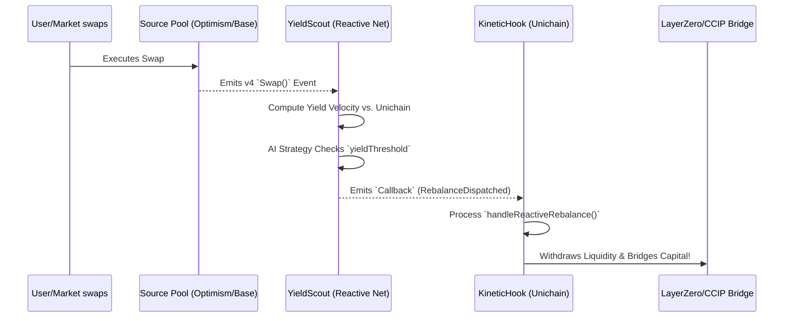

# 🏄 KineticYield: Autonomous AI-LP Rebalancer

 
 


**KineticYield** is an autonomous multi-chain liquidity management engine that eliminates "lazy capital." By leveraging the **Reactive Network** as a cross-chain brain and integrating **AI-driven sentiment and volume forecasting**, it monitors the entire DeFi ecosystem and proactively shifts Uniswap v4 liquidity to the highest-yielding opportunities before the market moves.

---

## 🎯 The Problems It Solves

> [!IMPORTANT]
> 1. **Liquidity Fragmentation**: Capital is trapped in low-yield pools while other chains experience volume spikes.
> 2. **High Opportunity Cost**: Liquidity Providers (LPs) miss out on massive fee events on other L2s because they cannot react in real-time.
> 3. **The "Static Logic" Limit**: Traditional fixed-logic rebalancers can be gamed by traders. An AI-enhanced approach adapts to changing market regimes securely.

---

## 🚀 Hackathon Alignment

Our project proudly aligns with the following Reactive Network focus areas:
- 💸 **Liquidity Optimizations**: Automating capital movement to high-yield pools.
- 🔮 **Oracle Hooks**: Creating "Global Awareness" by aggregating price/volatility data across chains.
- 🛡️ **Arbitrage (Prevention)**: Protecting LPs from toxic arbitrage flow through proactive fee adjustments.

---

## 🏗️ Architecture & How It Works

KineticYield consists of three primary components that work in tandem:

### 1. 🤖 Off-chain AI Intelligence (Predictive Rebalancing)
- An AI model (LLM or Time-Series Transformer) monitors social sentiment, whale movements, and macro data.
- The AI periodically updates the Reactive Contract's `yieldThreshold` and `minConfidenceScore` parameters, shifting the system from *reactive* to *predictive* rebalancing.
- Reactive execution only bridging capital when predictive confidence is optimal.

### 2. ⚡ Reactive Contract: `YieldScout.sol` (The Brain)
- Deployed on the **Reactive Network (ReactVM)**.
- **Monitors** subscriptions to Uniswap `Swap` events across Ethereum, Arbitrum, and Base.
- **Calculates** real-time "Yield Velocity" (Fees per Liquidity unit).
- **Predicts & Triggers** conditions relative to local baseline yields and AI parameters, emitting an event to trigger bridging payloads.

### 3. Hooks: `KineticHook.sol` (The Executor)
- Deployed primarily on **Unichain** (or any destination chain).
- Tracks localized pool utilization via `beforeSwap` and `afterSwap`.
- Contains `handleReactiveRebalance()` — a heavily safeguarded function callable *only* by the Reactive Network.
- Automates liquidity withdrawal via the Uniswap v4 `IPoolManager` and initiates bridging intent.

---

## 🌊 The Event-Driven Loop



---

## 🛠 Getting Started

### Prerequisites

Ensure you have [Foundry / Forge](https://book.getfoundry.sh/getting-started/installation) installed.

### Installation

Clone the repository and install dependencies:

```bash
git clone <your-repo-url>
cd kineticYield/v4-template
forge install
```

### Build & Test

To build the smart contracts:
```bash
forge build
```

Run the exhaustive test suite covering State Management, Yield Velocity calculation, AI Strategy Updates, and the Reactive Rebalance Callback logic:

```bash
forge test
```

For verbose output with traces:
```bash
forge test -vvv
```

---

## 📜 Smart Contracts

| Contract Name       | Role                                                                  | Location                                       |
| ------------------- | --------------------------------------------------------------------- | ---------------------------------------------- |
| **`KineticHook`** | V4 Hook handling local state locking, withdrawal, and bridge signals. | `v4-template/src/KineticHook.sol` |
| **`YieldScout`**  | Reactive network contract monitoring multi-chain swaps autonomously.  | `v4-template/src/YieldScout.sol`  |

---

## 🔐 Security & Features

- ✅ **Self-Custodial & Extensible**: Designed to pair with external LayerZero/CCIP vaults.
- ✅ **Strict Permissioning**: Core bridging loop secured by an `onlyReactive` modifier.
- ✅ **Pause functionality**: Emergency toggle configurable by Hook Owners.
- ✅ **Off-Chain Synergies**: Cryptographic verification mapping to AI strategies.

---

## 📝 License

This project is licensed under the MIT License.,.
